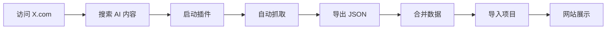

# 🎨 X.com AI 提示词抓取器

> 专为 AI Prompt Gallery 项目设计的智能提示词采集工具

## ⚡ 快速开始

```bash
# 1. 安装插件
打开 Chrome → chrome://extensions/ → 启用开发者模式 → 加载 x-scraper 文件夹

# 2. 访问 X.com 并搜索
https://x.com/search?q=%23Midjourney&f=live

# 3. 点击插件图标 → 开始抓取 → 导出 JSON

# 4. 合并数据到项目
npm run merge-prompts path/to/ai-prompts-*.json
```

**📖 详细文档**: [QUICKSTART.md](QUICKSTART.md)

---

## 📚 文档导航

| 文档 | 说明 | 适合 |
|------|------|------|
| [README.md](README.md) | 完整功能说明和安装指南 | 所有人 |
| [QUICKSTART.md](QUICKSTART.md) | 5分钟快速上手 | 新手 |
| [USAGE.md](USAGE.md) | 详细使用场景和技巧 | 进阶用户 |
| [SUMMARY.md](SUMMARY.md) | 项目总结和技术栈 | 开发者 |
| [config.js](config.js) | 配置选项（可自定义） | 高级用户 |

---

## ✨ 核心特性

### 🤖 智能识别
- 支持 **20+ AI 模型**自动识别
- **中英文关键词**匹配
- 自动分类（Midjourney, SD, DALL-E...）

### 🖼️ 高质量图片
- 自动获取**原图链接**（name=orig）
- 支持**多图抓取**
- 图片排序保持原顺序

### 🏷️ 自动标签
- 提取推文 **#hashtags**
- 识别 AI 模型名称
- 生成标准化分类

### 📊 完整数据
- 标题、描述、内容
- 作者信息和时间戳
- 互动数据（点赞/转发/回复）
- 来源链接追溯

### 🔍 智能过滤
✅ **只保留**：包含 AI 关键词 + 有图片
❌ **自动过滤**：纯文本、无关内容

---

## 🎯 支持的 AI 模型

### 图像生成
`Midjourney` `Stable Diffusion` `DALL-E` `Flux` `Leonardo` `Firefly` `Imagen` `Ideogram` `Playground`

### 视频生成
`Sora` `Runway` `Pika` `Kling` `Hailuo`

### 工具平台
`ComfyUI` `ControlNet` `LoRA` `Automatic1111`

### 文本生成
`ChatGPT` `Claude` `Gemini` `Grok`

**完整列表**: 查看 [config.js](config.js)

---

## 📦 数据格式

```json
[
  {
    "title": "精美的赛博朋克城市夜景",
    "description": "使用 Midjourney v6 生成的未来都市",
    "content": "cyberpunk city at night, neon lights...",
    "author": "AI Artist",
    "category": "Midjourney",
    "image": "https://pbs.twimg.com/.../image.jpg?name=orig",
    "images": ["url1", "url2", "url3"],
    "tags": ["cyberpunk", "midjourney", "neon"],
    "likesCount": 1234,
    "featured": false,
    "sourceUrl": "https://x.com/user/status/123456",
    "extractedAt": "2024-12-12T10:30:00.000Z"
  }
]
```

**✅ 完全兼容项目数据库结构**

---

## 🛠️ 使用流程



### 详细步骤

1. **准备阶段**
   - 安装浏览器插件
   - 阅读快速开始指南

2. **抓取阶段**
   - 访问 X.com 目标页面
   - 启动插件开始收集
   - 观察进度和日志

3. **处理阶段**
   - 导出 JSON 文件
   - 运行合并脚本
   - 验证数据质量

4. **集成阶段**
   - 数据自动合并到 `data/aiart-prompts.json`
   - 启动项目查看效果
   - 部署到生产环境

---

## 🔧 自定义配置

### 添加新的 AI 模型关键词

编辑 `config.js`:

```javascript
export const AI_KEYWORDS = {
  imageModels: [
    // 现有的...
    'your-new-model',  // 添加你的模型
  ],
};
```

### 调整抓取行为

```javascript
export const SCRAPING_CONFIG = {
  scrollDelay: 2000,     // 滚动延迟（毫秒）
  maxItems: 0,           // 最大抓取数（0=无限制）
  requireImages: true,   // 必须有图片
  minImages: 1,          // 最少图片数
};
```

**重新加载插件后生效**

---

## 📈 数据质量保证

### 自动化处理
- ✅ 关键词匹配过滤
- ✅ 图片存在验证
- ✅ 文本清洗（移除URL、空白）
- ✅ 自动去重（基于来源链接）
- ✅ 格式标准化

### 合并脚本功能
```bash
node x-scraper/merge-data.js ai-prompts-*.json
```
- 📋 自动备份原数据
- 🔄 合并新旧数据
- 🔍 智能去重
- 📊 输出统计报告

---

## 💡 最佳实践

### 1️⃣ 精确搜索
```
# 组合关键词
Midjourney prompt architecture

# 排除干扰
AI art -NFT -crypto

# 指定作者
(from:username) prompt

# 时间范围
since:2024-12-01 Midjourney
```

### 2️⃣ 分批次抓取
- 每次 50-100 条
- 避免一次性过多
- 定期导出备份

### 3️⃣ 质量控制
- 关注高质量创作者
- 使用 "Top" 排序
- 手动审核数据
- 删除重复内容

### 4️⃣ 定期更新
- 建立采集计划
- 每周更新内容
- 关注新模型发布
- 追踪热门标签

---

## 🔗 项目集成

### 数据流
```
X.com 推文
    ↓ 浏览器插件抓取
JSON 文件
    ↓ merge-data.js
data/aiart-prompts.json
    ↓ 项目导入脚本
Supabase 数据库
    ↓ API 查询
网站前端展示
```

### 快捷命令

```bash
# 开发环境
npm run dev

# 合并数据
npm run merge-prompts path/to/file.json

# 导入到 Supabase
npm run supabase:import-data
```

---

## 🐛 问题排查

| 问题 | 解决方案 |
|------|----------|
| 插件不工作 | 刷新页面，检查域名是否为 x.com |
| 没有抓到数据 | 检查关键词配置，尝试不同搜索 |
| 数据格式错误 | 验证 JSON 格式，查看浏览器控制台 |
| 合并失败 | 检查文件路径，确保 JSON 有效 |

**详细故障排除**: [USAGE.md#常见问题](USAGE.md#常见问题)

---

## 📊 项目统计

- **支持模型**: 20+ AI 生成模型
- **关键词数**: 50+ 中英文关键词
- **文件数**: 11 个核心文件
- **文档页**: 5 个详细文档
- **代码行**: ~1000 行

---

## 🚀 未来计划

- [ ] 批量图片下载
- [ ] Supabase 直接同步
- [ ] 提示词质量评分
- [ ] 自定义规则界面
- [ ] 导出多种格式
- [ ] 数据统计面板
- [ ] 定时自动抓取

**欢迎贡献想法！** 🎉

---

## 📄 许可证

MIT License - 自由使用、修改、分发

---

## 🙏 相关链接

- 📂 [主项目 README](../README.md)
- 🎨 [AI Prompt Gallery](https://github.com/yourusername/aipic)
- 📚 [Chrome Extension 文档](https://developer.chrome.com/docs/extensions/)
- 🗄️ [Supabase 文档](https://supabase.com/docs)

---

<div align="center">

**✨ 享受收集 AI 提示词的乐趣！✨**

Made with ❤️ for the AI Art Community

[快速开始](QUICKSTART.md) • [完整文档](README.md) • [使用技巧](USAGE.md)

</div>
